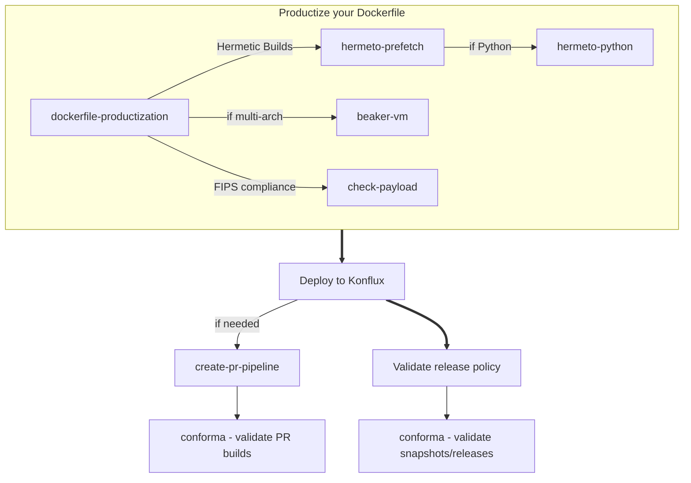

# konflux-cookbook

A collection of guides and tools for getting production-ready builds working on Konflux

## Manifesto

Give developers the local tools and knowledge to have confidence that their konflux builds will not have issues downstream.

## Things that cause issues downstream

- Hermetic Builds
- Conforma
- FIPS
- Support for PowerPC and IBM Z (power/z)

## Structure

```
konflux-cookbook/
├── guides/           # Human-readable how-to guides (standalone documentation)
├── skills/           # Claude Code skills (agent automation, references guides/)
└── .claude-plugin/   # Plugin manifest
```

- **`guides/`** -- Step-by-step guides you can follow manually.
- **`skills/`** -- Claude Code plugin skills that reference the guides. Use the skills to have claude walk you through a guide.
- `scripts/` -- Runnable implementations of what the guides describe (scripts, Makefiles). Some automate a guide end-to-end given the right inputs; others provide incremental targets for iterative workflows.

## Guide order

The guides build on each other. Start at the top and work down.



<details>
<summary>Text version (if mermaid doesn't render)</summary>

```
  1. Productize your Dockerfile
     dockerfile-productization ──> hermeto-prefetch ──> hermeto-python (if Python)
                               ──> check-payload (FIPS compliance)
                               ──> beaker-vm (if multi-arch, use throughout productization)
              |
              v
  2. Deploy to Konflux
     deploying-to-konflux ──> create-pr-pipeline (if needed)
              |                        |
              |                        v
              |               conforma (validate PR builds)
              |
              v
  3. Validate release policy compliance
     conforma (validate snapshots/releases)
```

</details>

> **Note:** [conforma](guides/conforma.md) requires images built by a Konflux pipeline — it validates artifacts (signatures, attestations, SBOMs) that only exist for Konflux builds. You cannot run it against locally-built images.

## Guides

| Guide | Description |
|-------|-------------|
| [dockerfile-productization](guides/dockerfile-productization.md) | Prepare and productize a Dockerfile for Konflux builds |
| [hermeto-prefetch](guides/hermeto-prefetch.md) | Set up hermetic builds with Hermeto (pre-fetch dependencies for offline container builds) |
| [hermeto-python](guides/hermeto-python.md) | Python requirements, AIPCC wheels, and source builds for hermetic Konflux builds |
| [check-payload](guides/check-payload.md) | Run check-payload locally to verify FIPS compliance in container images |
| [beaker-vm](guides/beaker-vm.md) | Provision a VM on Beaker for multi-arch build testing |
| [deploying-to-konflux](guides/deploying-to-konflux.md) | Deploy locally-working hermetic build config to Konflux pipelines for RHOAI components |
| [create-pr-pipeline](guides/create-pr-pipeline.md) | Create a temporary pull request PipelineRun from a push PipelineRun to test build changes on an RHOAI release branch |
| [conforma](guides/conforma.md) | Run Conforma (Enterprise Contract) validation against a single image or Konflux snapshot to check release policy compliance |

## Using as a Claude Code plugin

Install locally for testing:

```
claude --plugin-dir /path/to/konflux-cookbook
```

Once installed, the skills are available as slash commands (e.g., `/konflux-cookbook:create-pr-pipeline`).
