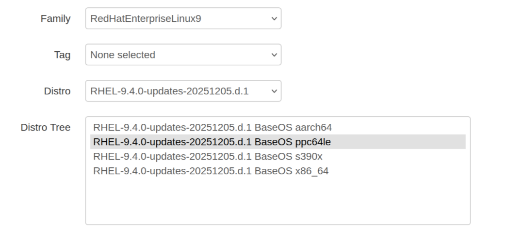
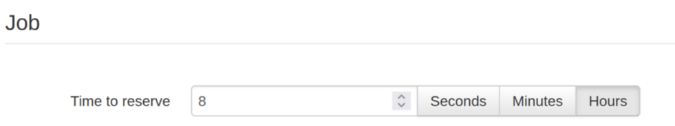
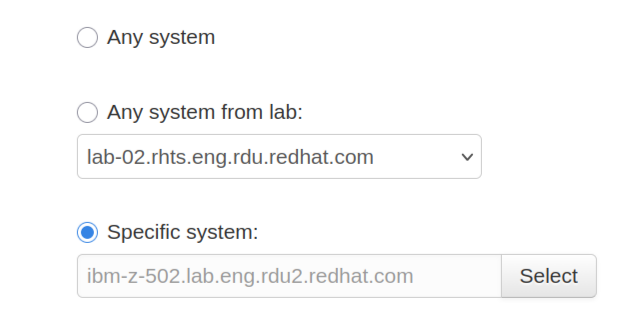
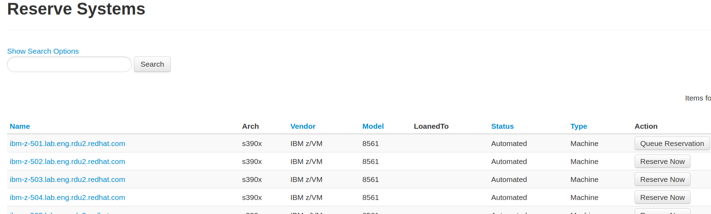

# Provisioning a VM on Beaker for Multi-Arch Testing

> **Note:** These instructions were written for the internal Red Hat Beaker system and require Red Hat Kerberos credentials and VPN access.

## What is Beaker

[Beaker](https://beaker.engineering.redhat.com/) is Red Hat's hardware provisioning system. It lets you reserve physical and virtual machines across architectures (x86_64, aarch64, ppc64le, s390x) for testing. This is useful when you need to validate builds on architectures you don't have locally -- especially ppc64le and s390x, which are difficult to obtain otherwise.

Once you have a machine provisioned, you can use it as a remote build host for hermetic build testing. See [Testing on Remote Architectures](hermeto-prefetch.md#testing-on-remote-architectures) in the hermeto guide for how to sync your project and run builds remotely.

## Prerequisites

- Red Hat Kerberos credentials
- Access to the Red Hat VPN

## Reserving a Machine

1. Go to the [Beaker reserve workflow](https://beaker.engineering.redhat.com/reserveworkflow/) and log in with your Kerberos credentials.

2. Select a distro family and distro tree for your target architecture. For example, select **RedHatEnterpriseLinux9** and pick the BaseOS tree for ppc64le or s390x:

   

3. Set the reservation time based on your needs:

   

4. Choose a system. You can select "Any system", pick a lab, or click **Select** next to "Specific system" to browse available machines:

   

   The system search shows available machines with their architecture, vendor, and a **Reserve Now** button. Use **Show Search Options** to filter by hardware requirements:

   

5. Click **Submit job** and wait for your recipe to finish provisioning.

6. Once provisioned, SSH into the machine as root. The default root password is shown in your [Beaker preferences](https://beaker.engineering.redhat.com/prefs/#root-password). Setting up SSH key auth (described in the next section) is recommended over using the default password.

## Automating with the `bkr` CLI

The `bkr` command-line client can automate everything above. It uses Kerberos for authentication -- if you have a valid ticket from `kinit`, it works automatically.

### Setup

**On Fedora/RHEL:**

```bash
sudo dnf install -y beaker-client
```

**On macOS:**

The `beaker-client` package is on [PyPI](https://pypi.org/project/beaker-client/) but is only officially supported on Linux. Use `uv run` to run it with no permanent install. It requires `setuptools<70` (for `pkg_resources`) and `pip-system-certs` (so Python trusts the Red Hat internal CA from your macOS Keychain):

```bash
uv run --with 'beaker-client' --with 'setuptools<70' --with 'pip-system-certs' -- bkr whoami
```

To avoid typing that every time, add a shell alias:

```bash
alias bkr='uv run --with beaker-client --with "setuptools<70" --with pip-system-certs -- bkr'
```

> **Note:** Running `bkr` in a podman container on macOS doesn't work well because macOS stores Kerberos tickets in its native Keychain API rather than a file, so they can't be mounted into the container. The `uv run` approach uses macOS Kerberos natively.

**Configure the client:**

Create `~/.beaker_client/config` pointing at the Red Hat Beaker instance with Kerberos auth:

```bash
mkdir -p ~/.beaker_client
cat > ~/.beaker_client/config <<'EOF'
HUB_URL = "https://beaker.engineering.redhat.com"
AUTH_METHOD = "krbv"
EOF
```

**Verify access:**

```bash
kinit your-username@REDHAT.COM
bkr whoami
```

### Add your SSH key

Beaker installs SSH keys from your user preferences into every system you provision. Upload your public key so you can SSH in without the default root password.

The easiest way is through the [Beaker preferences](https://beaker.engineering.redhat.com/prefs/) web UI — paste your public key and save.

Alternatively, upload via the API (requires Kerberos negotiate auth and a two-step cookie exchange):

```bash
# Your Kerberos username (confirm with the .username field from `bkr whoami`)
BEAKER_USER=your-username
SSH_KEY=$HOME/.ssh/id_ed25519.pub

# Authenticate and upload (Beaker requires a login step to get a session cookie)
curl --negotiate -u : -c /tmp/beaker-cookies -b /tmp/beaker-cookies \
  -X POST https://beaker.engineering.redhat.com/login/

curl -b /tmp/beaker-cookies -X POST \
  -H "Content-Type: text/plain" \
  --data-binary @$SSH_KEY \
  https://beaker.engineering.redhat.com/users/$BEAKER_USER/ssh-public-keys/
```

### Provision a machine

Use `bkr workflow-simple` to build a reservation. Start with `--dry-run --pretty-xml` to preview the job XML without submitting:

```bash
bkr workflow-simple \
  --arch ppc64le \
  --family RedHatEnterpriseLinux9 \
  --variant BaseOS \
  --task /distribution/check-install \
  --reserve \
  --reserve-duration 86400 \
  --dry-run --pretty-xml
```

Change `--arch` to `s390x`, `aarch64`, or `x86_64` as needed. The `--reserve-duration` is in seconds (86400 = 24 hours).

Pre-install packages so the system is ready to use on first SSH. Use `--ks-append` to inject commands into the kickstart `%post` section, which runs during initial OS setup:

```bash
bkr workflow-simple \
  --arch ppc64le \
  --family RedHatEnterpriseLinux9 \
  --variant BaseOS \
  --task /distribution/check-install \
  --ks-append '%post
dnf install -y git podman rsync
%end' \
  --reserve \
  --reserve-duration 86400 \
  --dry-run --pretty-xml
```

Add memory or disk requirements with `--keyvalue` (values in MB):

```bash
bkr workflow-simple \
  --arch s390x \
  --family RedHatEnterpriseLinux9 \
  --variant BaseOS \
  --keyvalue "MEMORY>8000" \
  --keyvalue "DISKSPACE>50000" \
  --task /distribution/check-install \
  --reserve \
  --reserve-duration 86400 \
  --dry-run --pretty-xml
```

**Pre-check system availability before submitting.** If no systems match your constraints, the job aborts immediately with "does not match any systems." Use `bkr system-list` to verify that matching systems exist:

```bash
# Check how many systems match your arch + hardware constraints
bkr system-list --arch=s390x --type=Machine --status=Automated \
  --xml-filter='<and><key_value key="MEMORY" op=">" value="8000"/><key_value key="DISKSPACE" op=">" value="50000"/></and>' \
  | wc -l
```

If the count is zero, relax your constraints (drop `DISKSPACE`, lower `MEMORY`, etc.) before submitting. Drop `--xml-filter` entirely to see all available systems for an architecture.

Once the XML looks right, remove `--dry-run --pretty-xml` to submit the job for real. Provisioning takes some time -- use `bkr job-watch` to monitor progress.

### Monitoring your job

`workflow-simple` returns a job ID (e.g., `J:12674717`). Watch it in real time:

```bash
bkr job-watch J:12674717
```

Or check status at any point:

```bash
bkr job-results J:12674717 --prettyxml
```

You can also view it in the browser at `https://beaker.engineering.redhat.com/jobs/12674717` (the numeric part without `J:`).

To get the hostname of your provisioned system:

```bash
bkr job-results J:12674717 --prettyxml | grep -o 'system="[^"]*"'
```

### After provisioning

When the system is ready, you'll receive an email with the system FQDN, or you can check using the CLI command above. SSH in as root (your SSH key is already installed if you configured it above). On the provisioned system, two scripts are available:

- `return2beaker.sh` -- release the system early when you're done
- `extendtesttime.sh` -- extend your reservation if you need more time

## Setting Up the Machine

Install the minimum dependencies needed for building:

```bash
dnf install -y git podman rsync
```

From here, follow the [Testing on Remote Architectures](hermeto-prefetch.md#testing-on-remote-architectures) section in the hermeto guide to sync your project from your local machine and run the hermetic build on the Beaker host.
